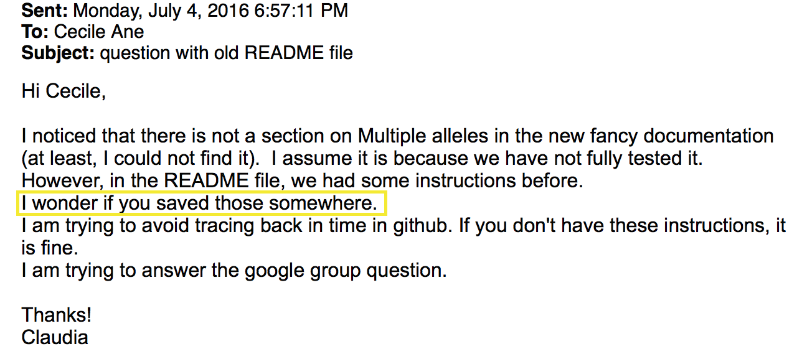
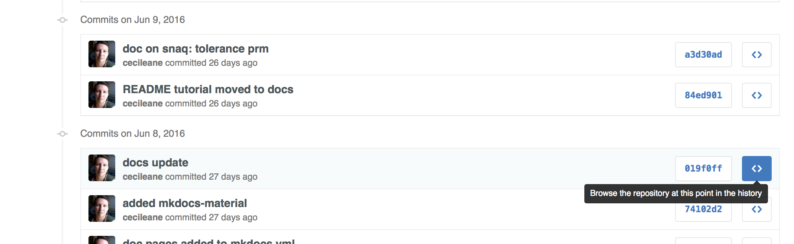

[previous](notes0922.html) & [next](notes0929.html)

---

## homework

Submit your solution to exercises 1 & 2 of homework 1
using git and github: see
[submission instructions](https://github.com/UWMadison-computingtools/coursedata#commit-push-and-submit-your-work).
Also see the [grading rubric](https://github.com/UWMadison-computingtools/coursedata#grading-rubric). Make sure

- your code is annotated with comments in the scripts
- you have readme files to give higher-level explanations and all
  the tools (commands) to reproduce your results.
- you do *not* need to commit the input files (in `out/` and `log/` directories).
  I already have them. No big deal if you did already, though.

## Git: track and share versions of a project

- you take snapshots of your project once in a while. one "commit" = one snapshot
- git stores the changes between snapshots, not the whole files
- git stores its data (changes) in a special `.git` directory
- you can easily restore the whole project to a previous snapshot, then
  get back to the latest snapshot
- each collaborator has the project on her/his local machine, and
  another remote copy of the project is on GitHub.
  Collaborators can "pull" from GitHub and "push" to GitHub.

jump to:

- [examples](#first-examples)
- [commits, staging area, working directory](#commits-staging-area-working-directory)
- [commit messages](#commit-messages)
- [looking at history](#looking-at-history)
- [moving / deleting tracked files](#use-git-to-move-or-delete-tracked-files)
- [what (not) to track](#what-files-not-to-track--commit)
- [your turn: hw 1](#your-turn)
- [using older commits to fix mistakes](#using-older-commits-to-fix-mistakes)
- [pushing to / pulling from github to work with others](#pushing-to--pulling-from-github-to-work-with-others)
- [resolving conflicts: merge commits](#resolving-conflicts-and-merge-commits)
- [checking out older versions](#checking-out-older-versions)
- [branches](#branches) and [merging branches](#merging-branches)
- [some other git subcommands](#some-other-git-subcommands)
- [sha checksums](#sha-checksums)

### first examples

history of repository for the course website:

```shell
git log --abbrev-commit --graph --pretty=oneline --all --decorate
```

example when it was useful to get back to an old version:



we can get the old version of this file in a few clicks:

- go to the project on [github](https://github.com/crsl4/PhyloNetworks.jl)
- click on "863 commits" (or whatever the number is) near top left
- scroll down to a commit that seems to have affected our file of interest



- click on "Browse the repository at this point in the history"
  to see all the files as they were *just before* the change that affected our
  file (June 8th). Tada!
- notice the commit SHA near the top: "Tree: 019f0ff78d".
  Click on it to get back to the current version of the files, typically
  "Branch: master"

---
let's create a repository from our corn SNPs project

```shell
cd ~/Documents/private/st679/zmays-snps
ls -lR
git init # initialize repo: creates .git/
git status
git add readme.md data/readme # git now tracks these files
git status
echo "Zea Mays SNP Calling Project" >> readme.md
cat readme.md
git status # readme.md is tracked, previous version in staging area, new version not
```

### commits, staging area, working directory

commit -- ... -- commit -- staging area -- working directory: tracked files, untracked files

```shell
git diff # differences between new version and staged area (if present) or last commit
git add readme.md # adding new edits to staging area
git status        # readme.md only in staging area
git diff          # no differences btw working dir and staging area
git diff --staged # diff between staging area and last commit
```

now take the snapshot

```shell
git commit -m "initial commit, main readme only"
```
With `git commit` only, an editor will show up to let you edit your
commit message. If you get a weird-behaving editing window (vim),
type `:q!` (to quit without saving) then change your git configuration to use
nano instead of vim:

```shell
git config --global core.editor nano
```

### commit messages

- first line: title
  * informative. forbidden: "update", "continued", "new code", "misc", "edits"
  * 50 of fewer characters is strongly recommended
- if more explanations are needed: add one blank line
- then your explanation paragraph

informativeness: helps to recover old versions (example above)  
separation of title vs paragraph: good example
[here](https://github.com/crsl4/PhyloNetworks.jl/commit/310a81a90db2661bbba3efae1db2378d3f15f88b), suboptimal example
[here](https://github.com/khabbazian/l1ou/commit/bc8df7a9caffbb06d7bef298bdf6c5f7c1df92f9)

### looking at history

let's check:

```shell
git show   # shows last commit: title, paragraph, diffs: change "hunks"
git status # nothing in staging area, but some files not tracked
git log
```

add more edits:

```shell
echo "Project started 2016-09-14" >> readme.md
git diff
git commit -a -m "added project info to main readme"
git log
```

option `-a` in git commit: to add all changes in tracked file to the commit.

### use git to move or delete tracked files

```shell
git mv data/readme data/readme.md
git status
git commit -m "added markdown extension to data readme"
git log
```

### what files (not) to track / commit

track:

- scripts
- text documentation with metadata: explain where the data are archived,
  how to reproduce result files
- notebooks (code + explanations + interpretations) in text format
  (md or html): but preferably only final version of 'compiled'/knitted version.

do **not** track:

- large files that can be reproduced by the pipeline
- large data files: if can be obtained from outside archive
- binary files: document where they were obtained or how to recompile
- pdf and figures: document how they can be reproduced

We can tell git to ignore files that we do not want to track.

```shell
touch .gitignore
echo "data/seqs/*.fastq" >> .gitignore
cat .gitignore
git status # fastq files not listed anymore. but need to track .gitignore
git commit -a -m "added .gitignore, to ignore large fastq data files"
git status # all good
```

### your turn

- how would you turn an existing git repository into a normal benign folder?
- go to your work folder (containing homework 1 only, for now):
  * ask git to track your script(s) for homework 1
  * commit your work
  * add some more documentation / explanations
  * commit these new changes
  * add something silly: like remove 1 or 2 lines, as if accidentally (and save).  
    make sure you had committed your work **before** saving these mistakes.

### using older commits to fix mistakes

```shell
echo "todo: ask sequencing center about adapters" > readme.md
cat readme.md # oops
git status    # git tells us how to undo our change
git checkout -- readme.md # to checkout 'readme.md' from the last commit
cat readme.md # yes!
git status
```

your turn: undo your mistake from above

What if the mistake has been staged?

```shell
echo "todo: ask sequencing center about adapters" > readme.md
git add readme.md
git status  # again, follow git's instructions
git reset HEAD readme.md
git status
cat readme.md # mistake still there, but unstaged
git checkout -- readme.md
cat readme.md # yes!
git status
```

### pushing to / pulling from github to work with others

various repositories:
cecile (laptop) -- central (claudia's github) -- claudia (laptop)  
we can: `git push`, `git clone`, `git pull`, `git fetch` (to check before), `git merge`

To illustrate this, I will to create a central repository:
new repository owned by "UWMadison-computingtools", say. I'll go to
[github](https://github.com/UWMadison-computingtools), click "New repository",
name it "zmays-snps". Then back to my shell and link my private repository
to the new central repo on github:

```shell
git remote -v
git remote add git@github.com:UWMadison-computingtools/zmays-snps.git
git remote -v
git branch
git push origin master
```

Now let's go back to [github](https://github.com/UWMadison-computingtools/zmays-snps)
to check! Go check the "network" page to visualize the list of commits
(in Graphs tab)

your turn: push your homework to github:

```shell
git branch # to double-check which branch you are on. default: master
git remote -v # check the nickname for your central (github) repo. default: origin
git push origin master # pushes current local branch to repo "origin", its branch "master"
```

Now I need a collaborator. Volunteer? Jonathan?
(check that you can push to github easily: `ssh -T git@github.com` should
give you a "Hi!" message)

Jonathan can pull the repository: first navigate to a directory that is
*not* already a git repository (do `git status` to check). Then:

```shell
# Jonathan doing this:
git clone git@github.com:UWMadison-computingtools/zmays-snps.git
cd zmays-snps
git remote -v
```

Let me can start working on the project, say add metadata info:

```shell
# Cecile doing this:
echo "Samples expected from sequencing facility 2016-09-30" >> README.md
git commit -a -m "added information about samples"
git log --pretty=oneline --abbrev-commit
gl # this is my own alias for "git log" with particular options
type gl
git log --abbrev-commit --graph --pretty=oneline --all --decorate
```

(check the update on github). Jonathan can pull these changes from his shell:

```shell
$ git pull origin master # Jonathan doing this
remote: Counting objects: 5, done.
remote: Compressing objects: 100% (3/3), done.
...
From github.com:UWMadison-computingtools/zmays-snps
...
Fast-forward
 README.md | 1 +
 1 file changed, 1 insertion(+)
-> FETCH_HEAD
-> origin/master
$ git log --pretty=oneline --abbrev-commit
```

Next, Jonathan can work on the project, say add more metadata still:

```shell
# Jonathan does this. -e to interpret \n as newline
echo -e "\n\nMaize reference genome version: refgen3" >> README.md
git commit -a -m "added reference genome info"
git push origin master
```

and I can get his work easily (also check on github):

```shell
git pull origin master # Cecile doing this
cat README.md
git log # viewed with less
git log -n 2
```

Very important:

- pull often!
- commit your changes before pulling. Any change to an uncommitted file
  would stop the pull update.

### resolving conflicts and merge commits

Now let's create a conflict to see how to resolve it.
Let me and Jonathan make changes to the same file, at roughly the same place:

```shell
# Jonathan does this:
echo -e ", downloaded 2016-09-27 from\nhttp://maizegdb.org into `/share/data/refgen3/`." >> README.md
git commit -a -m "added download info"
git push origin master
```

while I open the README.md file to change the last line to this:

> We downloaded refgen3 on 2016-09-27.

then I also commit and push:

```shell
# Cecile does this:
git commit -a -m "added genome download date"
git push origin master # Ahh, problem!!
```

The push was rejected!
I first need to pull Jonathan's update. Perhaps it will be smooth,
perhaps there will be conflict. If so, it's my responsibility to resolve
the conflicts:

```shell
# Cecile does this:
git pull origin master
git status # conflict. tells me what to do to resolve it
git log --pretty=oneline --abbrev-commit
```

I need to edit the file with the conflict: git told me it's `README.md`,
then search for:

- `<<<<<<< HEAD` : beginning of my version, then
- `=======` boundary: end of my version and beginning of fetched version, then
- `>>>>>>> SHA value`: end of new, fetched version,
  with Jonathan's commit indicated by its SHA.

I can now edit this file and remove these 3 marks (there may be multiple blocks
of conflicts, each with these 3 marks). Let me replace both versions with
some improved information:

  > We downloaded the B73 reference genome (refgen3) on 2016-09-27 from
  > http://maizegdb.org into `/share/data/refgen3/`.

let's continue to follow git's instructions:

```shell
# Cecile doing this:
git status
git add README.md
git status
git commit -a -m "resolved merge conflict in README.md"
git status
git log --abbrev-commit --pretty=oneline --graph
git push origin master
```

last step: quickly push the conflict resolution before Jonathan
does some more work. Lesson: both Jonathan and I should pull often!

```shell
# Jonathan does this:
git pull origin master
git log --graph
```

- merge commits have 2 parents, unlike usual commits.
- if you feel overwhelmed during a merge, do `git merge --abort`
  and start the various merge steps from scratch.
- remember: `git status` gives instructions

### checking out older versions

Let's recover some old version now, then go back to latest committed version:

```shell
git log # copy-paste the SHA from this result to xxx and yyy below
git checkout xxx -- README.md
cat README.md
gl # using my alias
git checkout yyy -- README.md
```

### branches

Branches are very useful to easily switch back and forth between different
versions. Each version can still evolve.

Imagine that I want to develop a new aspect of the project, not ready to
work with the rest of the pipeline --say risky edits to the README file (!):

```shell
git branch readme-changes # creates a branch
git branch # lists the existing branches
git checkout readme-changes # switches the current branch
git branch
git log --abbrev-commit --graph --pretty=oneline --all --decorate
```

Now let me make a bold move and make thorough edits to my README file,
then commit my changes:

```shell
git commit -a -m "reformatted readme, added sample info"
git log --abbrev-commit --pretty=oneline -n 3
git branch
git checkout master
git log --abbrev-commit --pretty=oneline -n 3
git log --abbrev-commit --pretty=oneline --graph --all --decorate
cat README.md # old version: on master branch
echo ">adapter-1\\nGATGATCATTCAGCGACTACGATCG" >> adapters.fa
git add adapters.fa # add a new file. on master branch here
git commit -a -m "added adapters file"
git log --abbrev-commit --pretty=oneline --graph --branches -n5
```

Branches are like pointers. They do not hold info. Commits do.

### merging branches

Imagine that I am happy with the new developments done in branch "readme-changes",
and it's ready to be used by my collaborators on the main "master" branch.

```shell
git checkout master
git branch # to triple-check we are on master
git merge readme-changes # no conflict, yes! enter commit message
git log --abbrev-commit --graph --pretty=oneline --all --decorate
git push origin master
```

This is a merge commit with 2 parents:
just like when we resolved a conflict earlier.  
We can use *remote* branches too. Jonathan could pull my changes,
including the new "readme-changes" branch, and switch to it if he wanted
to collaborate on this branch.  
When all done with this branch, I can delete it:

```shell
git branch -d readme-changes
```

<!--
### remote branches

Now Jonathan creates a branch "new-methods" ...
but pull first: remember to pull often!

```shell
# Jonathan does this:
git pull origin master
git branch new-methods
git branch
git checkout new-methods
```
-->

### some other git subcommands

- `git commit --amend` to add change the last commit message.
  But **do not** do this if you already pushed your change to github.
- `git revert` to revert changes (creates a new commit)
- `git reset` and `git rebase`: I very highly recommend that you **do not**
  use them, until you know exactly what you do. Even then, do **not**
  use them if you already pushed your commits to github.
- github provides more options: forks (multiple public repositories),
  pull requests.

### SHA checksums

SHA = security hash algorithm,
used by git to guard again data corruption.  
A small change in the input causes many changes in the SHA value.  
It is a good idea to record the SHA values of important data files
as metadata (in readme file).

```shell
$ echo "this sentence is super cool" | shasum
93aff6c8139fff6855797afc8ea7a7513ffabb6f  -
$ echo "this sentence is duper cool" | shasum
97c250becdaa49c62721478c7f82d116e1039e0e  -
$ shasum data/seqs/* # copy-paste results in readme file
$ md5 data/seqs/*    # alternatively: record MD5 checksums
```

check [RStudio](https://www.rstudio.com/products/rstudio/download/)
download page for MD5 checksums: to make sure that what you get
on your laptop is the true and uncorrupted thing:
`md5 RStudio-downloadedfile.zip` and compare with expected MD5 value.

<!--
example algorithm: consider each pair of byte as an integer in 0-15,
add them all up, return their value modulo 16: hexadecimal code in 0-9a-f
-->


---
[previous](notes0922.html) & [top](#git-track-and-share-versions-of-a-project)
& [next](notes0929.html)
